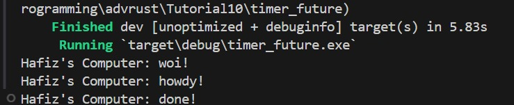
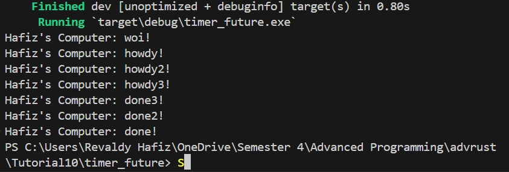
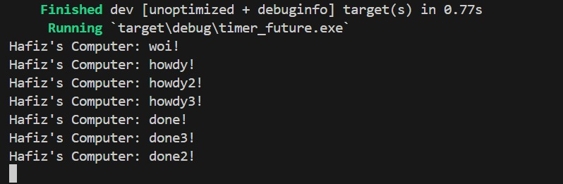

# Tutorial 10

## Timer

### Experiment 1.2: Understanding how it works.

The line `Hafiz's Computer: woi!` is printed first as it resides in the main function, outside the asynchronous task. Conversely, the remaining lines are situated within the asynchronous task. The main function executes first, after which the asynchronous task runs concurrently.

### Experiment 1.3: Understanding how it works.

Replicating the `spawner.spawn` block initiates two asynchronous tasks, which might execute concurrently and produce varied output orders. Removing the `drop(spawner)` line could lead to the program indefinitely waiting for new tasks, possibly causing hanging or deadlock. In contrast, with the drop spawn, task completion is evident, leading to a normal program termination.
